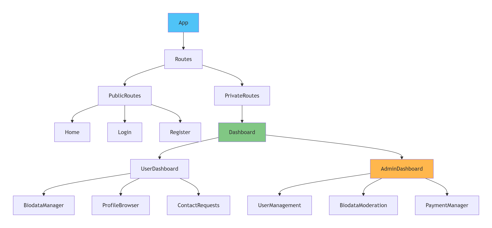
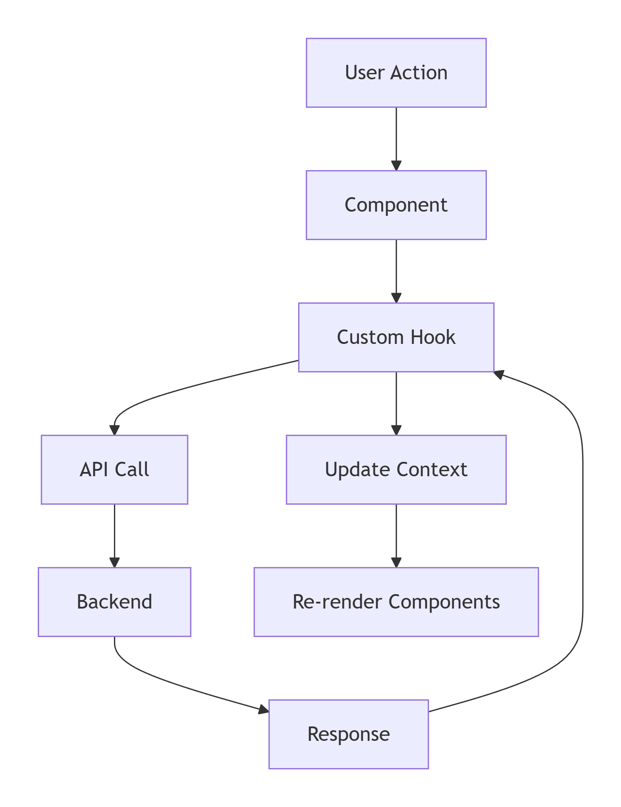

Matrimony Platform – Frontend

A modern, responsive Matrimony web application built with React.js and Tailwind CSS. This platform facilitates matrimonial connections with role-based dashboards, biodata management, and AI-powered matchmaking features.

🌐 Live Demo
Live Site: https://metrimoniyal.netlify.app/

📑 Table of Contents
✨ Core Features

🏗️ System Architecture

📁 Project Structure

🔐 Authentication Flow

🔄 State Management

🤖 AI Chatbot Integration

🔌 API Integration

🚀 Installation & Setup

⚙️ Environment Variables

📦 Scripts

👨‍💻 Author

✨ Core Features
🎯 User Features
Biodata Management: Create, update, and manage detailed matrimonial profiles

Smart Matching: AI-powered profile matching with advanced filters

Contact Requests: Secure contact exchange system with privacy controls

Premium Membership: Tiered subscription plans with enhanced features

Favorites System: Bookmark and track interesting profiles

👑 Admin Features
Dashboard Analytics: Visual statistics and platform insights

User Management: Approve, suspend, or delete user accounts

Biodata Moderation: Review and verify submitted biodatas

Payment Management: Monitor premium subscription transactions

Content Management: Manage platform content and announcements

🤖 AI Assistant
Smart Matchmaking: AI suggests compatible profiles based on preferences

Profile Optimization: Recommendations for improving biodata visibility

Conversation Starter: AI-generated icebreakers for initial contact

Personalized Tips: Custom advice based on user behavior and preferences

📱 Responsive Design
Mobile-first responsive layout

Cross-browser compatibility

Dark/Light mode support

Accessibility compliant (WCAG 2.1)

🏗️ System Architecture
System Architecture Overview:
c:\Users\LENOVO\Downloads\deepseek_mermaid_20260210_45dede.png

Data Flow Architecture:

Component Hierarchy & State Flow

📁 Project Structure:
client/
├── src/
│   ├── assets/                 # Static assets (images, icons)
│   │   ├── images/
│   │   └── icons/
│   │
│   ├── components/             # Reusable UI components
│   │   ├── AboutUs/           # About page components
│   │   ├── Admin_Control/     # Admin dashboard components
│   │   │   ├── DashboardStats.jsx
│   │   │   ├── UserManagement.jsx
│   │   │   └── ContentModeration.jsx
│   │   ├── Authentication/    # Auth-related components
│   │   ├── Biodata/           # Biodata management components
│   │   │   ├── BiodataForm.jsx
│   │   │   ├── BiodataView.jsx
│   │   │   └── BiodataFilters.jsx
│   │   ├── Chatbot/           # AI Chatbot components
│   │   │   ├── ChatInterface.jsx
│   │   │   ├── MessageBubble.jsx
│   │   │   └── SuggestionsPanel.jsx
│   │   ├── Premium/           # Premium features
│   │   ├── UI/                # Generic UI components
│   │   │   ├── Button.jsx
│   │   │   ├── Modal.jsx
│   │   │   └── LoadingSpinner.jsx
│   │   └── Layout/            # Layout components
│   │       ├── Navbar.jsx
│   │       ├── Footer.jsx
│   │       └── Sidebar.jsx
│   │
│   ├── context/               # React Context providers
│   │   ├── AuthContext.jsx
│   │   ├── ThemeContext.jsx
│   │   └── ChatbotContext.jsx
│   │
│   ├── hooks/                 # Custom React hooks
│   │   ├── useAuth.js
│   │   ├── useAdmin.js
│   │   ├── useAxiosSecure.js
│   │   ├── useBiodata.js
│   │   └── useChatbot.js
│   │
│   ├── pages/                 # Page components
│   │   ├── Home/
│   │   ├── Dashboard/
│   │   │   ├── UserDashboard.jsx
│   │   │   └── AdminDashboard.jsx
│   │   ├── Auth/
│   │   ├── Browse/
│   │   └── Profile/
│   │
│   ├── services/              # API and external services
│   │   ├── api.js            # Axios configuration
│   │   ├── auth.js           # Firebase auth service
│   │   ├── biodata.js        # Biodata API calls
│   │   └── chatbot.js        # AI service integration
│   │
│   ├── utils/                 # Utility functions
│   │   ├── validators.js
│   │   ├── formatters.js
│   │   └── constants.js
│   │
│   ├── routes/                # Routing configuration
│   │   ├── PrivateRoute.jsx
│   │   ├── AdminRoute.jsx
│   │   └── routes.js
│   │
│   ├── App.jsx               # Root component
│   ├── main.jsx              # Entry point
│   └── index.css             # Global styles
│
├── public/                   # Static public files
├── .env                      # Environment variables
├── .env.example             # Environment template
├── package.json
└── README.md

🔐 Authentication Flow

Key Authentication Features:
Firebase Authentication with email/password

JWT token management for API authorization

Automatic token refresh mechanism

Role-based access control (User/Admin)

Session persistence across page reloads

State Flow Diagram:
