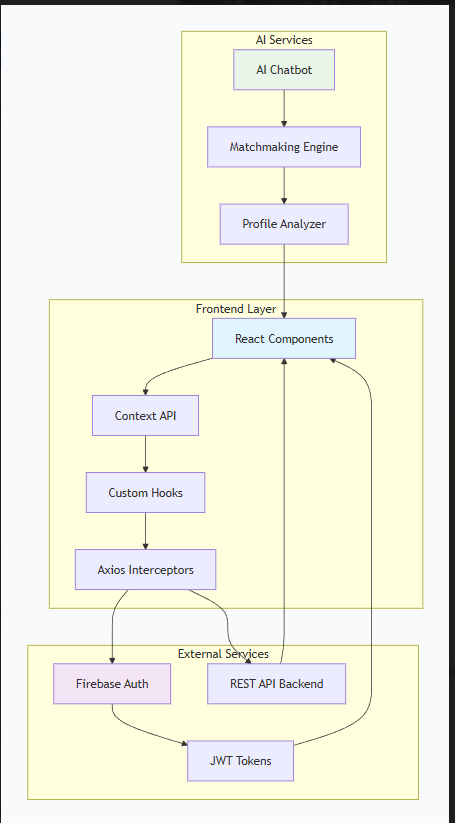

Matrimony Platform – Frontend

A modern, responsive Matrimony web application built with React.js and Tailwind CSS. This platform facilitates matrimonial connections with role-based dashboards, biodata management, and AI-powered matchmaking features.

🌐 Live Demo
Live Site: https://metrimoniyal.netlify.app/

📑 Table of Contents
✨ Core Features

🏗️ System Architecture

📁 Project Structure

🔐 Authentication Flow

🔄 State Management

🤖 AI Chatbot Integration

🔌 API Integration

🚀 Installation & Setup

⚙️ Environment Variables

📦 Scripts

👨‍💻 Author

✨ Core Features
🎯 User Features
Biodata Management: Create, update, and manage detailed matrimonial profiles

Smart Matching: AI-powered profile matching with advanced filters

Contact Requests: Secure contact exchange system with privacy controls

Premium Membership: Tiered subscription plans with enhanced features

Favorites System: Bookmark and track interesting profiles

👑 Admin Features
Dashboard Analytics: Visual statistics and platform insights

User Management: Approve, suspend, or delete user accounts

Biodata Moderation: Review and verify submitted biodatas

Payment Management: Monitor premium subscription transactions

Content Management: Manage platform content and announcements

🤖 AI Assistant
Smart Matchmaking: AI suggests compatible profiles based on preferences

Profile Optimization: Recommendations for improving biodata visibility

Conversation Starter: AI-generated icebreakers for initial contact

Personalized Tips: Custom advice based on user behavior and preferences

📱 Responsive Design
Mobile-first responsive layout

Cross-browser compatibility

Dark/Light mode support

Accessibility compliant (WCAG 2.1)

🏗️ System Architecture
System Architecture Overview

